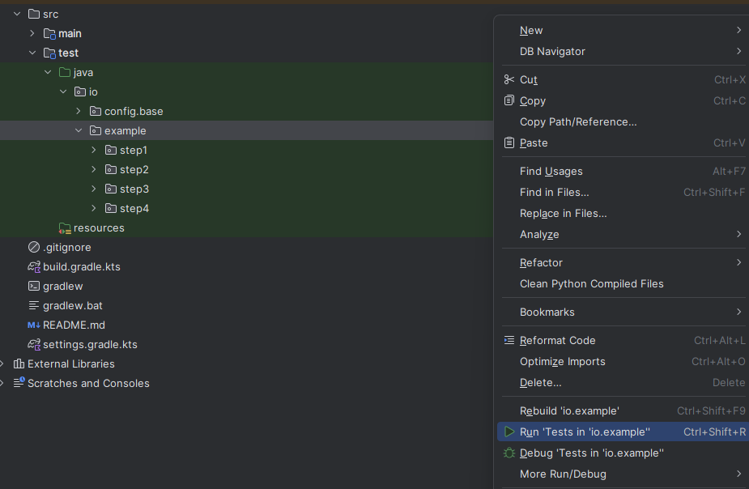
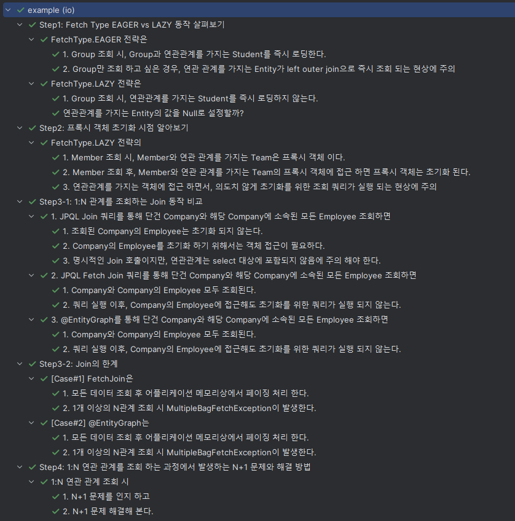

JPA 학습
===
# 목차
- Step1: Fetch Type EAGER vs LAZY 동작 살펴보기
- Step2: 프록시 객체 초기화 시점 알아보기
- Step3-1: 1:N 관계를 조회하는 Join 동작 비교해보기
- Step3-2: Join의 한계점 알아보기
- Step4: 1:N 연관 관계를 조회 하는 과정에서 발생하는 N+1 문제와 해결 방법 알아보기

# 실행 방법
1. src/test/java/io/example 우클릭
2. Run 'Tests in 'io.example'' 클릭

